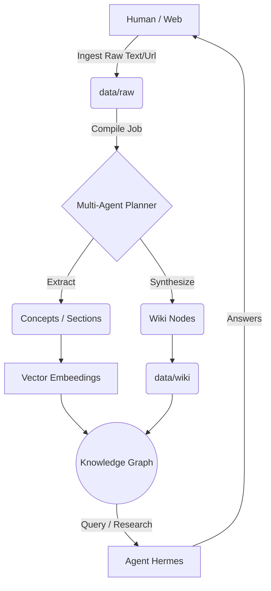

# Knowledge Foundry (知识熔炉) - AI 个人大脑中枢 v2.1

> “把散落的信息喂给它，让 AI 替你自动编织一张能思考的概念神经网络。”

**Knowledge Foundry** 是一个以“Markdown 原生文件系统”为底层支撑，结合多智能体（Multi-Agent）协同工作的开源本地化知识库系统。
它舍弃了传统笨重的关系型或抽象向量数据库，**一切显式数据都以纯文本的 Markdown/JSON 落盘**，保障数据主权的绝对归属。搭配赛博朋克风格的“多图层实时交互面板”与常驻后台的“自动演化 Nanobot”，为你提供具有“生命体征”的新一代 AI 知识管家体验。

---

## 🏗️ 核心系统架构 (Architecture)

Knowledge Foundry 采用极简但高内聚的 **双模分离架构**：纯净的后端微服务架构 + 零编译原生前端。

### 1. 服务层 (Backend - Node.js)
位于 `services/api/` 目录下，负责承接上层调用、调度大模型并维护本地状态。
- **Core Server (`server.mjs`)**: 端口 3210。采用无包依赖的热插拔式轻量路由，提供 `/health` (心跳及拓扑)、`/sources` (生肉投喂)、`/concepts` (神经簇查询) 和各类 `/jobs/*` 主动触发接口。
- **Storage Layer (`core/store.mjs`)**: 基于 `fs/promises` 的本地存储驱动，数据结构清晰划分：`data/raw`（原样数据池）、`data/wiki`（大模型合成知识）、`data/indexes`（多维索引目录）。
- **Multi-Agent Engine (`core/jobs/`) & (`core/agent.mjs`)**: 智能调度引擎。负责派发不同的子任务给 AI：解析器、架构提纯师、自动校对节点等。
- **Nanobot Daemon (`daemon.mjs`)**: 一个全天候常驻的“暗网幽灵”。利用 **SSE (Server-Sent Events)** 机制，在资源闲置时触发突触重组、概念撞击、甚至生成新的猜想，且实时将心跳脉冲通过流下发到前端大屏。
- **MCP Server (`mcp-server.mjs`)**: 机器通信特化协议通道，支持接入大模型的标准 MCP 协议，方便作为外部智能体的底层插件调用。

### 2. 交互层 (Frontend - Vanilla JS)
位于 `apps/web/` 目录下，由 `preview.mjs` 提供反向代理和轻量级托管（端口 4173）。
- **零构建束缚**: 无需 Vite、Webpack 等繁重打包器。纯原生 ES Module（`main.js`, `dashboard.js`, `views.js`）+ CSS 堆叠，追求绝对的修改响应速度。
- **Neon 赛博控制台**: 
  - **核心全景管控仪**: 实时同步知识提取状态和网格健康度。
  - **动态拓扑星图**: 使用 HTML5 Canvas 自绘的动态物理仿真引擎（带重力和碰撞），直接肉眼观测神经节点的繁衍。
  - **SYS.NANOBOT_NODE_STREAM**: 右下角内嵌矩阵终端黑盒，实时刷阅后端 AI 长连接吐出的内在“沉思流”。

### 3. 数据流转架构


---

## 🛠️ 安装与部署指南 (Setup Guide)

系统崇尚极简克制，只需纯粹的 Node.js (v22+) 环境即可。

### 1. 环境准备
确保您的机器已安装 Node.js >= 22，系统能够运行 `npm` 和 PowerShell（Windows 推荐，同时兼容 Mac/Linux Bash）。

配置环境变量 `.env`，务必填充模型调用渠道凭证：
```ini
OPENAI_API_KEY="sk-xxxx"
# （可选）如需使用外部或特定智谱向量模型
BACKEND_ORIGIN="http://127.0.0.1:3210"
NANOBOT_ENABLED="1" # 开启暗脑重组进程（建议打开）
```

### 2. 初始化与启动服务
不要繁复的配置，开箱即用：

```bash
# 1. 自动执行依赖探测与环境铺设 (会预装 transformers 等模块)
npm run orchestrate

# 2. 启动核心引擎
# （在终端 A 运行 - 监听 3210）
npm run api:start

# 3. 启动交互中枢面板
# （在终端 B 运行 - 监听 4173）
npm run web:preview
```

### 3. 访问系统
服务启动后，打开浏览器访问 **`http://127.0.0.1:4173`** 即可进入极控中心。

---

## 🤖 核心能力与用法说明书 (User Manual)

控制台界面提供了“主推进阀 (Main Core)”操作区。这不仅是个“上传按钮”，更是一系列唤醒 AI 自动进化的指令发射器。

### 📌 阶段一：给大脑喂料 (Ingest)
通过点击 **📥 倾倒原样数据 (Ingest)**：
可以将晦涩难读 PDF、零散的工作文档、甚至网页 URL 灌入。这会仅仅把原始文件写入 `data/raw`，此时知识还是“生肉”。

### 📌 阶段二：暴力重织与进化 (Compile)
喂料后，点击 **⏺ 暴力重织整个网络 (Compile)**：
此时进入高燃时刻——后端 AI 引擎会被全部点亮。
- **并发提取**：AI 开始深挖生肉数据，提炼核心概念、发现段落关联。
- **可视追踪**：注意看右下角的黑客终端，所有的抽象化进度（蓝色神入、黄色警告）都会如同瀑布流般直观吐出！
- 稍作等待，面板中部的**星图**便会涌现出五颜六色的“神经元”，知识宇宙由此建立。

### 📌 阶段三：主动外部探索 (Research)
最新加入的杀手级功能！点击 **🛰️ 外部主题研究 (Research)**：
- 直接输入你想要调研的前沿课题（如：Agentic Workflow）。
- 贴入两三个参考链接。
- 系统会激活网络抓取探针，自动从外网啃下长篇网页，并在内部交叉引证生成 Research Artifact。最后，这个全新概念将挂载到你的本地拓扑图上。

### 📌 阶段四：AI 闲置期的内心戏 (Brainstorm / Reconcile)
- 即便你不作任何动作，因为常驻了 **Nanobot 进程**，每隔半分钟，AI 都有几率背着你发起“自愈校对（清除矛盾幻觉）”或者“深层梦话（把八竿子打不着的概念强行发生碰撞）”。
- 若嫌太慢，可以点击 **🌌 灵感潜意识碰撞** 和 **⚕️ 全网冲突调解自愈** 强行启动此进程。

### 📌 阶段五：唤雷之眼 (Search / Chat)
想要变现你的知识资产？点击 **🧠 唤雷之眼 (Hermes)** 随时与属于你的私有数据集进行强关联对话对话。系统会自动利用内建索引对你问出的每个字符寻找确凿出处。

---

## 👨‍💻 二开与技术扩展 (For Developers)

- **替换大模型**：我们目前针对 `core/config.mjs` 中的 `callLLM` 具备泛用性接口。你可以轻松地拦截并把它指向 Ollama 以追求 100% 离线脱网的高隐私化局域网办公部署。
- **自定义 Web 皮肤**：`apps/web/index.css` 控制了所有 Neon Glowing 效果；所有路由均被设计为模块注入流，极其利于剥离成组件或套上 Tauri / Electron 的壳成为桌面应用端。 
- **MCP 外部注入**：通过 `npm run api:mcp` 可以启动一个供外部 AI 助手调用的能力端口，让 Cursor 等代码编辑器工具能够“反向寄生”在这套认知中枢库上。

> “你的第二大脑，如今已经有了自己的心跳。”

---

## 📜 项目声明与开源协议 (License & Declaration)

- **开源协议 (MIT License)**: 本项目基于 [MIT License](LICENSE) 协议开源。您可以自由地使用、修改和分发，但请务必保留原始的版权声明。
- **概念实验性工程**: Knowledge Foundry 是致力于实现 Andrej Karpathy 提出的 **"LLM OS"** (大语言模型为核心的操作系统) 理念的一次极客工程化探索。当前仍在极速迭代和活跃演进之中，内部 Agent 可能存在一定的涌现行为与不确定性。
- **绝对数据隐私与主权**: 本系统奉行 **数据主权绝对归属** 的原则。一切输入与生成的知识产出均 **100% 留存在本地** 的 `data/` 目录下（纯文本 Markdown/JSON）。您的私域数据永远不会被平台方收集或用于其他商业化大模型的语料捕获。

