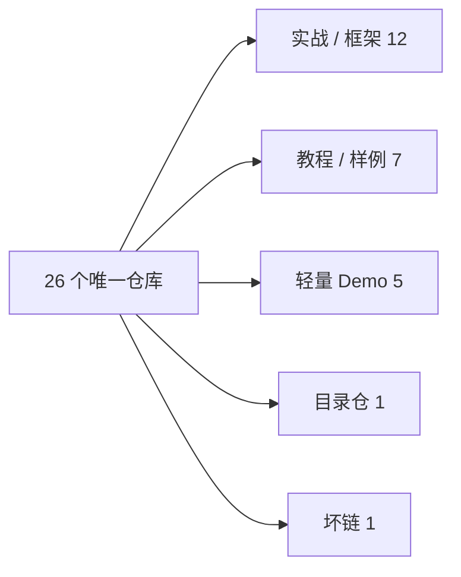
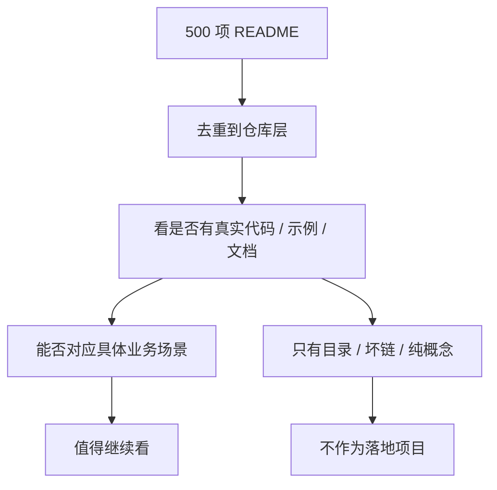

# 500_AI_Agents_Projects_README_仓库实勘报告.md

## Source Type
markdown

## Notes
# 500 AI Agents Projects 仓库三列表

## 一页结论

- 这份不是再抄一遍 `500+` 用例，而是把 README 里能对位到的仓库去重后，压成一张能直接判断的表
- 真正值得继续看的，优先集中在 `多 Agent 框架`、`RAG / Workflow`、`安全红队`、`行业 Agent` 这 4 类
- `目录仓` 和 `坏链仓` 要明确剔除，不然很容易把“资料入口”误判成“落地项目”

## 仓库分层图

## 实勘判断流程图

## 代表性 GitHub 封面图

| 仓库 | 封面图 |
| --- | --- |
| microsoft/autogen |  |
| agno-agi/agno |  |
| langchain-ai/langgraph |  |
| crewAIInc/crewAI-examples |  |
| NirDiamant/GenAI_Agents |  |
| microsoft/RecAI |  |
| PurpleAILAB/Decepticon |  |

## 第二组重点仓库封面墙

| 仓库 | 封面图 |
| --- | --- |
| microsoft/OptiGuide |  |
| harshhh28/hia |  |
| sentient-engineering/jobber |  |
| NVISOsecurity/cyber-security-llm-agents |  |

| 仓库 | 业务场景 | 是否值得继续看 |
| --- | --- | --- |
| [`microsoft/autogen`](https://github.com/microsoft/autogen) | 多 Agent 协作、代码生成、工具调用、评测 | 非常值得 |
| [`agno-agi/agno`](https://github.com/agno-agi/agno) | 支持 Agent、研究 Agent、金融、法务、推荐、MCP | 非常值得 |
| [`langchain-ai/langgraph`](https://github.com/langchain-ai/langgraph) | 多 Agent Workflow、RAG、SQL Agent、代码助手 | 非常值得 |
| [`crewAIInc/crewAI-examples`](https://github.com/crewAIInc/crewAI-examples) | 邮件自动回复、会议助手、Lead Score、招聘、旅行、内容生成 | 非常值得 |
| [`NirDiamant/GenAI_Agents`](https://github.com/NirDiamant/GenAI_Agents) | 客服 Agent、各类 Agent 教程 | 非常值得 |
| [`microsoft/RecAI`](https://github.com/microsoft/RecAI) | 推荐系统、商品推荐 | 非常值得 |
| [`microsoft/OptiGuide`](https://github.com/microsoft/OptiGuide) | 物流优化、供应链优化 | 非常值得 |
| [`PurpleAILAB/Decepticon`](https://github.com/PurpleAILAB/Decepticon) | 红队测试、安全 Agent | 非常值得 |
| [`harshhh28/hia`](https://github.com/harshhh28/hia) | 医疗报告分析、健康洞察 | 非常值得 |
| [`sentient-engineering/jobber`](https://github.com/sentient-engineering/jobber) | 招聘推荐、人岗匹配 | 非常值得 |
| [`AleksNeStu/ai-real-estate-assistant`](https://github.com/AleksNeStu/ai-real-estate-assistant) | 房产分析、估价助手 | 值得看 |
| [`yecchen/MIRAI`](https://github.com/yecchen/MIRAI) | 能源需求预测 | 值得看 |
| [`crosleythomas/MirrorGPT`](https://github.com/crosleythomas/MirrorGPT) | 内容个性化、娱乐推荐 | 值得看 |
| [`NVISOsecurity/cyber-security-llm-agents`](https://github.com/NVISOsecurity/cyber-security-llm-agents) | 威胁检测、安全 Agent | 值得看 |
| [`MingyuJ666/Stockagent`](https://github.com/MingyuJ666/Stockagent) | 自动交易、股票分析 | 值得看 |
| [`sled-group/driVLMe`](https://github.com/sled-group/driVLMe) | 自动驾驶、自主配送 | 值得看 |
| [`Hoanganhvu123/ShoppingGPT`](https://github.com/Hoanganhvu123/ShoppingGPT) | 电商导购、个性化购物 | 值得看 |
| [`onjas-buidl/LLM-agent-game`](https://github.com/onjas-buidl/LLM-agent-game) | 游戏陪玩、游戏 Agent | 值得看 |
| [`ahmadvh/AI-Agents-for-Medical-Diagnostics`](https://github.com/ahmadvh/AI-Agents-for-Medical-Diagnostics) | 医疗诊断助手 | 一般 |
| [`hqanhh/EduGPT`](https://github.com/hqanhh/EduGPT) | 个性化教育、AI Tutor | 一般 |
| [`yuchenxia/llm4ias`](https://github.com/yuchenxia/llm4ias) | 工厂流程监控、工业自动化 | 一般 |
| [`mohammed97ashraf/LLM_Agri_Bot`](https://github.com/mohammed97ashraf/LLM_Agri_Bot) | 智慧农业 | 一般 |
| [`nirbar1985/ai-travel-agent`](https://github.com/nirbar1985/ai-travel-agent) | 旅行规划 | 一般 |
| [`firica/legalai`](https://github.com/firica/legalai) | 法律文档审查 | 一般 |
| [`ashishpatel26/500-AI-Agents-Projects`](https://github.com/ashishpatel26/500-AI-Agents-Projects) | AI Agent 用例导航、案例索引 | 不作为落地项目看 |
| [`MahmoudRabea13/MediSuite-Ai-Agent`](https://github.com/MahmoudRabea13/MediSuite-Ai-Agent) | 医疗保险理赔 Agent、医疗聊天机器人 | 不建议，已 404 |
